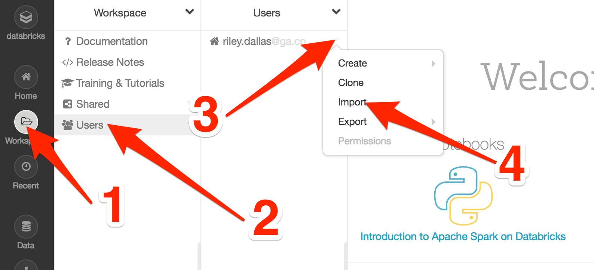
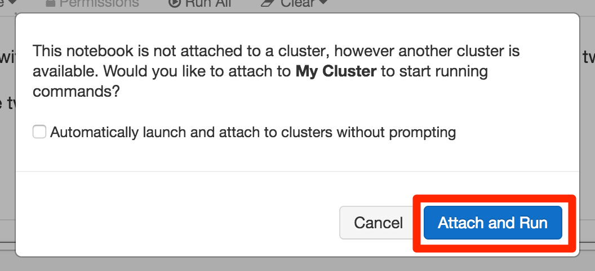

# Intro to Scala

To get started, you'll need to import the `Intro to Scala.html` notebook into your [DataBricks](https://community.cloud.databricks.com/) account:

1. Clone this repo to your laptop
2. Log into your [DataBricks](https://community.cloud.databricks.com/) account
3. Choose Workspace > Users > **YOURUSERACCOUNT** > Dropdown > Import (See below)
4. Navigate to and upload the `Intro to Scala.html` file in this repository

> Alternatively, you could **import** this URL into your Workspace:
>
> 
>
> **Import URL:** https://databricks-prod-cloudfront.cloud.databricks.com/public/4027ec902e239c93eaaa8714f173bcfc/4848986636455716/1644920477692286/418550261108810/latest.html

**NOTE**: When you first run a cell, you'll see the modal window below. Click `Attach and Run`. Since you're on the free plan, it will probably take a while for your cluster to run that first cell.

